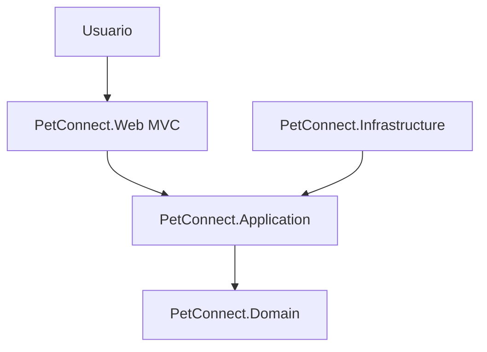
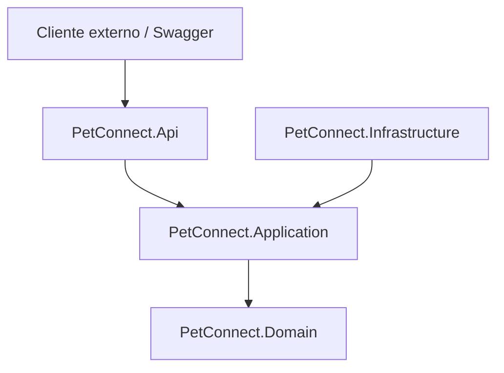

# Arquitectura de PetConnect

PetConnect usa una separacion simple por responsabilidades. La interfaz web MVC es la entrada principal para usuarios y la API sera un complemento tecnico para probar endpoints.

- `Web` y `Api` son adaptadores de entrada.
- `Application` contiene servicios y casos de uso.
- `Domain` contiene entidades y reglas principales.
- `Infrastructure` contiene repositorios en memoria.
