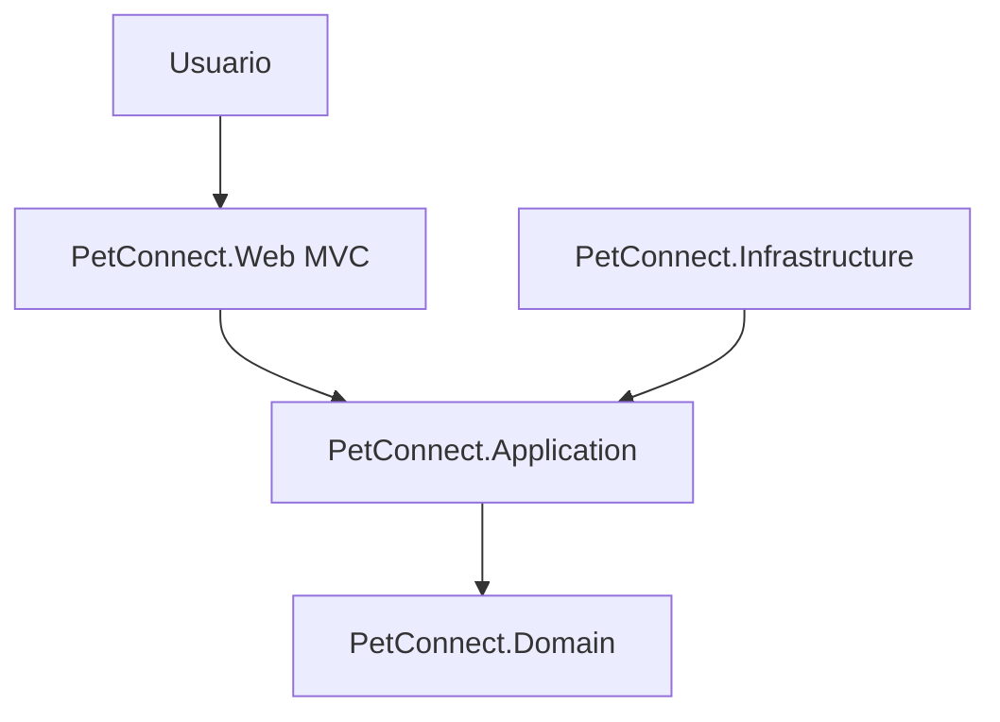
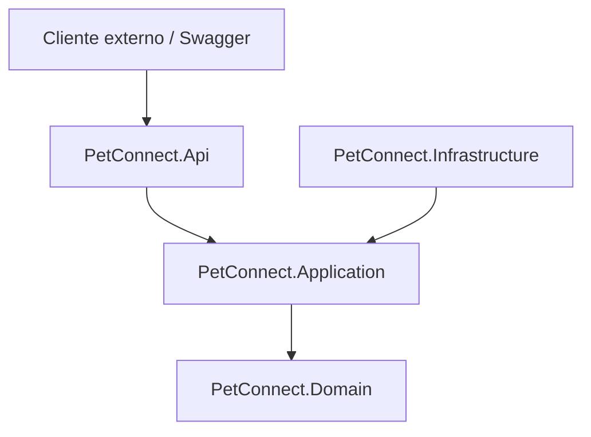

# Arquitectura de PetConnect

PetConnect usa arquitectura hexagonal de forma sencilla. La interfaz web MVC es la entrada principal para usuarios y la API sera un complemento tecnico para probar endpoints.

- `Web` y `Api` son adaptadores de entrada.
- `Application` contiene servicios y casos de uso.
- `Domain` contiene entidades y reglas principales.
- `Infrastructure` contiene repositorios en memoria.

## Responsabilidades

`PetConnect.Web` no debe concentrar reglas de negocio. Sus controladores reciben datos, llaman servicios de aplicacion y devuelven vistas.

`PetConnect.Application` contiene los puertos, DTOs, servicios y casos de uso. Esta capa coordina operaciones como crear solicitudes y cambiar su estado.

`PetConnect.Domain` contiene las entidades principales como `Mascota`, `Adoptante` y `SolicitudAdopcion`, ademas de excepciones de negocio.

`PetConnect.Infrastructure` implementa los repositorios en memoria y registra las dependencias que usa la aplicacion.
